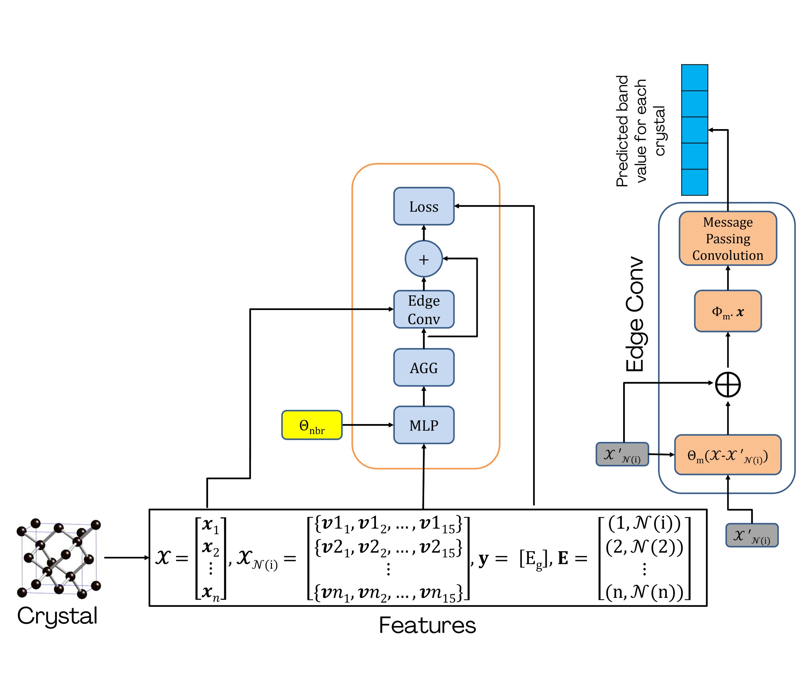

# Bridging Atomic and Bond Modalities: Crystal-X Network for Enhanced Bandgap Prediction

Welcome to the official GitHub repository for **Crystal-X** – an advanced graph neural network (GNN) model designed to accurately predict electronic band gaps in materials. This project builds upon the existing Crystal Graph Convolutional Neural Network (CGCNN) architecture by introducing edge-centered convolutions and a novel neighbor feature transformation.

---

# Abstract

Graph neural networks (GNNs) are key tools for predicting material properties at low computational cost by learning crystal structure representations. However, most approaches treat edge attributes as secondary to nodes despite bonds’ critical role in electronic properties. In this study, we introduce Crystal-X, a multimodal GNN architecture that connects atomic and bonding environments through edge-convolutional operations. Current node-centric models fall short in modeling complex bonding environments that determine bandgap values and other material properties. We analyze this limitation by exploring three aspects: performance across space groups, crystal centering types, and bandgap ranges. To address these identified shortcomings, we propose a simple solution: asymmetric edge convolutions with neighbor feature transformations, which directly supplement the missing bond information to GNNs. The resulting architecture achieves a bandgap prediction MAE of 0.26 eV on the Materials Project dataset—improving on CGCNN (0.39 eV), SchNet (0.42 eV), and MEGNet (0.33 eV)—with particular improvements for crystal materials for complex space groups (e.g., monoclinic systems, space groups 3–15), where bond interactions critically influence properties, and non-primitive centering types (e.g., face-centered lattices) with variable bond lengths. We implement granular analysis of the dataset, revealing the impact of data bias on learning and performance in underrepresented band gap classes, and 
identifying high-MAE outliers.

---

## Project Details

### Data Features Creation
- For generating dataset tensors, the algorithm proposed by CGCNN's authors was used. The original file can be viewed in their GitHub repo: https://github.com/txie-93/cgcnn

### Methodology
- **Model Architecture:** Builds upon CGCNN with the following key innovations:
  - **Neighbor Feature Transformation:** Transforms neighboring node features using a shared multi-layer perceptron (MLP).
  - **Asymmetric Edge Function:** Models directional atomic interactions via a learnable edge function.
  - **Edge Feature Aggregation:** Aggregates updated edge features to update node representations.
 

- **Training Details:**
  - **Learning Rate:** 1×10⁻³ (using AdamW)
  - **Batch Size:** 256
  - **Convolutional Layers:** 8 (with batch normalization)
  - **Epochs:** 200 (typically converges within 120 epochs)
  - **Hardware:** NVIDIA RTX 4090 GPU, Intel Core i9 CPU

### Key Results
- **Performance:** Achieves a MAE of 0.25 eV on band gap prediction using the Materials Project dataset.
- **Comparative Analysis:** Outperforms CGCNN (0.39 eV) and MEGNet (0.33 eV), with performance approaching ALIGNN (0.22 eV) but at a lower computational cost.
- **Error Analysis:** Demonstrates significant improvements in metallic compounds while highlighting challenges in semiconductor and insulator predictions.

### Future Directions
- Predict additional electronic properties.
- Integrate Crystal-X into automated discovery pipelines.
- Expand and diversify the materials dataset to address biases.

---

### Dataset
The Materials Project Dataset 2018 version was downloaded from this URL:
https://figshare.com/articles/dataset/Materials_Project_MP_2018_6_MODData/12834275?file=24364571

The 2022 version was imported using the MP API.

---

### Reproducing & Usage
Our code uses the following libraries:

PyTorch

Pymatgen

Materials Project API (MP_API)

**Running**
To run the notebook and code files, make a local directory root_dir in the same folder as the remaining files. Next, save the atom_init.json inside this folder. 

To use the MP 2022 dataset, replace the 'your_api_key' in data.py with your custom API key available upon creating a free account at Materials Project Dataset: https://next-gen.materialsproject.org/

Next, simply run each cell in the notebook.

For MP 2018 dataset, download the MODData file from the URL provided above. 

---

### How to Cite
Shehroz Ahmad Shoaib, Burhan SaifAddin. (2025). Bridging Atomic and Bond Modalities: Crystal-X Network for Enhanced Bandgap Prediction [Online]. Available: https://github.com/shehrozashoaib/Crystal-X

---

### Contact
For questions, collaborations, or further information:

Name: Shehroz Ahmad Shoaib
Email: s202353930@kfupm.edu.sa

Name: Burhan SaifAddin
Email: burhan.saifaddin@kfupm.edu.sa

